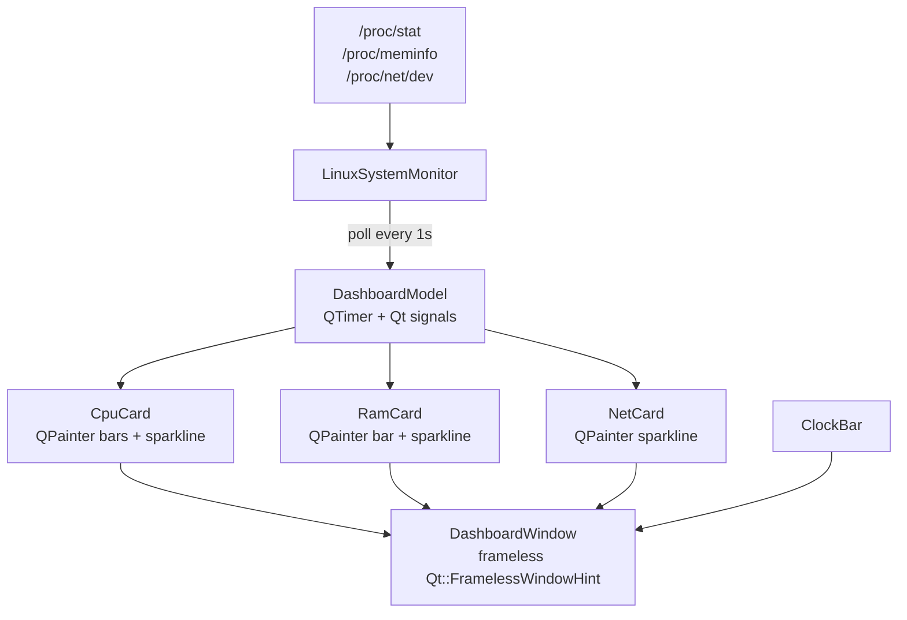

# sysmon-dashboard

Dark HUD system monitor dashboard built with Qt6 C++. Designed to sit on a secondary display showing live system metrics.


## UI Layout

```
┌─────────────────────────────────────────────────────┐
│                  sysmon-dashboard                   │
├───────────────┬─────────────────┬───────────────────┤
│  ◈  CPU       │  ◈  RAM         │  ◈  NET           │
│               │                 │                   │
│  core0 ████░  │  ████████░░░░░  │  ↑  4.46 KB/s    │
│  core1 ███░░  │  1.70 / 7.65 GB │  ↓  5.34 KB/s    │
│  core2 █░░░░  │                 │                   │
│  core3 ████░  │                 │                   │
│  core4 ██░░░  │                 │                   │
│  core5 ███░░  │                 │                   │
│  core6 █░░░░  │                 │                   │
│  core7 ░░░░░  │                 │                   │
│               │                 │                   │
│  ∿∿∿∿∿∿∿∿∿∿  │  ∿∿∿∿∿∿∿∿∿∿∿∿  │  ∿∿∿∿∿∿∿∿∿∿∿∿∿∿  │
├───────────────┴─────────────────┴───────────────────┤
│                  2026-07-05  17:54:43                │
└─────────────────────────────────────────────────────┘
```

## Architecture



## Features (V1)

- CPU utilisation per core — bar graph + sparkline
- RAM used/total GB — bar + sparkline
- Network upload/download KB/s — sparkline
- Frameless dark window, cyberpunk/HUD aesthetic
- Platform-abstracted backend (Linux first, Windows later)

## Tech Stack

- Qt6 (Widgets, Charts)
- C++17
- Linux `/proc` filesystem for metrics
- CMake 3.28

## Environment

- WSL2 Ubuntu, Qt 6.4.2, WSLg display
- Build: Qt Creator or `cmake --build`

## Build

```bash
mkdir build && cd build
cmake ..
cmake --build .
```
